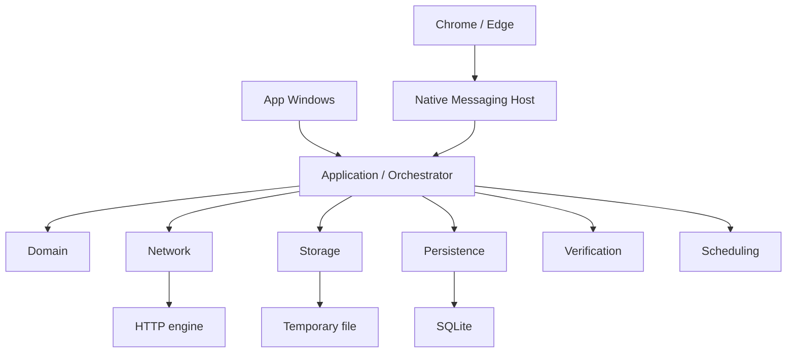
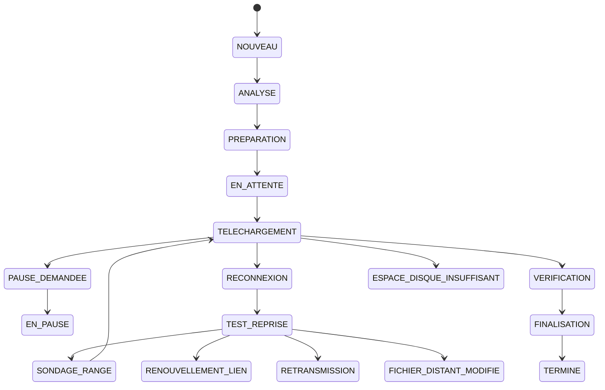

# Architecture technique

Version documentaire : 2.2  
Date de création : 2026-08-03  
Dernière mise à jour : 2026-08-04  
Statut : CIBLE C# ACCEPTÉE, IMPLÉMENTATION PARTIELLE, PROTOTYPE PYTHON SÉPARÉ  
Responsable logique : Architecte principal  
Documents liés : `DECISIONS_ARCHITECTURE.md`, `MODELISATION_DONNEES.md`, `SECURITE.md`

## Sommaire

1. État implémenté
2. Architecture cible
3. Composants et contrats
4. Commandes et événements
5. Machine d’états
6. Concurrence et transactions
7. Récupération et finalisation
8. Règles de dépendances

## État implémenté — prototype Python de référence

```text
CLI (idm/cli.py)
  -> DownloadEngine (idm/engine.py)
      -> analyse et flux HTTP (idm/network.py)
      -> états et objets (idm/models.py)
      -> dépôt SQLite (idm/persistence.py)
      -> fichier destination.download
      -> renommage atomique destination
```

## Responsabilités

- `cli.py` : commandes `add`, `run`, `list`, configuration et interception de `Ctrl+C`.
- `engine.py` : orchestration, réconciliation disque/base, reprises, recouvrement, tentatives,
  vérification finale et finalisation.
- `network.py` : validation d’URL, résolution d’adresse, sondage `Range`, métadonnées et requêtes.
- `persistence.py` : création du schéma SQLite et opérations sur les téléchargements.
- `models.py` : états, métadonnées distantes et tâche persistée.
- `tests/test_engine.py` : serveur HTTP local compatible `Range` et scénarios d’intégration.

## Flux de progression sûr

Recevoir → écrire → `flush` → `fsync` → enregistrer `confirmed_bytes` dans SQLite.
Au redémarrage, la position sûre est le minimum entre la base et la taille du fichier temporaire.
Les octets disque au-delà de cette position sont tronqués avant reprise.

## Reprise

La reprise demande une plage commençant 64 Kio avant la position confirmée. Cette zone est comparée
au fichier local avant toute nouvelle écriture. Un statut autre que `206` ou un `Content-Range`
incohérent bloque la reprise.

Le schéma ci-dessus ne décrit pas le moteur C#. Il reste conservé comme référence de comportement et
ne doit pas être utilisé pour conclure que SQLite ou la reprise existent dans le produit cible.

## État implémenté — produit C# cible

```text
Domain <- Application <- Network
                      <- Storage
                      <- Persistence
```

Présents : états et agrégat minimaux, identité distante, ports initiaux, analyse/transfert HTTP
streaming avec connexion à l’IP validée, writer durable, orchestrateur neuf, dépôt SQLite v3 et
diagnostics de récupération local/distant, décision combinée, recouvrement binaire et coordination
diagnostique en lecture seule. Un banc d’intégration injecte des fautes et tue un subprocess autour
de la frontière flush/checkpoint sur un puis deux blocs, y compris avant le deuxième appel disque.
Absents : reprise, erreur/crash pendant écriture, finalisation, ordonnanceur, UI et navigateur.

## Architecture cible non implémentée

`RecoveryService`, `DownloadScheduler`, segments dynamiques, limitation globale, interface Windows
et passerelle navigateur restent à concevoir et développer. Leur présence dans la vision ne doit pas
être interprétée comme du code existant.

## 2. Architecture cible Windows



Le domaine ne dépend ni de l’UI, ni de SQLite, ni du client HTTP. L’application orchestre des ports ;
les adaptateurs réseau, disque et base les implémentent. L’hôte navigateur n’accède jamais directement
au stockage.

## 3. Composants cibles et frontières

| Composant | Responsabilité | Interdit |
|---|---|---|
| `DownloadOrchestrator` | Cycle et transitions | Lire directement SQLite |
| `DownloadStrategyEngine` | Choisir simple/segmenté/prudent | Écrire des octets |
| `ForcedResumeEngine` | Sept niveaux de reprise | Contourner une protection |
| `SegmentManager` | Créer et redistribuer les plages | Finaliser le fichier |
| `RetryManager` | Classer, backoff, `Retry-After` | Relancer sans limite |
| `RemoteIdentityVerifier` | Validateurs et empreintes | Décider par IA |
| `TemporaryFileManager` | Cycle du temporaire | Le présenter comme final |
| `RandomAccessWriter` | Écrire/synchroniser par position | Base avant disque |
| `DiskSpaceMonitor` | Marge et alertes | Supprimer automatiquement |
| `DownloadScheduler` | Priorités et quotas | Modifier les segments |
| `BandwidthController` | Jetons de débit | Attendre sous verrou global |
| `DatabaseRepository` | Transactions et migrations | Règles métier |
| `FinalizationService` | Vérifier et renommer | Écraser silencieusement |
| `RecoveryService` | Réconcilier base/disque/distant | Faire confiance à un signal |
| `BrowserBridge` | Valider les messages | Exécuter une commande arbitraire |

## 4. Commandes, événements et erreurs

Commandes : `AddDownload`, `Start`, `Pause`, `Resume`, `Cancel`, `ReplaceUrl`, `ChangePriority`,
`RemoveHistory`. Événements : `StateChanged`, `BytesConfirmed`, `SegmentCompleted`, `RetryScheduled`,
`RemoteChanged`, `DiskUnavailable`, `DownloadFinalized`. Les événements UI sont des projections,
jamais la source de vérité.

Une erreur possède code stable, catégorie (`NETWORK`, `HTTP`, `DISK`, `AUTH`, `RESUME`, `SECURITY`),
caractère temporaire/permanent, action automatique, action utilisateur et détail expurgé.

## 5. Machine d’états cible



Autres états normatifs : `LIEN_EXPIRE`, `AUTHENTIFICATION_REQUISE`, `SERVEUR_RANGE_NON_FIABLE`,
`DESTINATION_INACCESSIBLE`, `ECHEC_TEMPORAIRE`, `ECHEC_PERMANENT`, `ANNULE`. Toute transition est
validée par le domaine, persistée, puis publiée. `TERMINE` et `ANNULE` sont terminaux.

## 6. Concurrence, verrous et transactions

Une tâche possède un orchestrateur logique et un segment au plus un écrivain. Les plages disjointes
peuvent être écrites concurremment ; la carte est protégée par verrou court. Aucun réseau ou `fsync`
sous verrou global. Une transaction enregistre checkpoint, segments et événement après confirmation
disque. Pause/annulation utilisent un jeton propagé et la fermeture attend un état récupérable borné.

## 7. Récupération et finalisation

Au démarrage : migrations → tâches non terminales → temporaires → position sûre → distant → reprise
ou action. Une base absente ne permet pas de deviner les segments ; le temporaire est préservé. La
finalisation exige carte complète, aucune écriture active, taille/hash, synchronisation, fermeture,
collision résolue, renommage atomique et transaction finale réparable.

## 8. Règles de dépendances

`App → Application`; `Application → Domain + ports`; adaptateurs → ports/domaine. Interdits :
UI → SQLite/fichier, Domain → framework Windows, Network → UI, extension → moteur interne. Toute
exception exige un ADR accepté.

## 9. Architecture retenue pour le démarrage

```text
src/
├── WindowsDownloadManager.Domain/          net10.0, aucune dépendance externe
├── WindowsDownloadManager.Application/     cas d’usage et ports
├── WindowsDownloadManager.Network/         HttpClient et protocoles HTTP
├── WindowsDownloadManager.Storage/         fichiers et écritures aléatoires
├── WindowsDownloadManager.Persistence/     SQLite et migrations
├── WindowsDownloadManager.Verification/    identité, plages et hash
├── WindowsDownloadManager.Scheduling/      file, priorités et débit
└── WindowsDownloadManager.App/             net10.0-windows, WinUI 3/MVVM
tests/
├── *.UnitTests/
├── *.IntegrationTests/
└── *.RecoveryTests/
```

La compilation doit fonctionner sans le projet App pour permettre les tests headless. Les transferts
utilisent `Stream`, `Memory<byte>` et buffers mutualisés ; aucune charge complète en mémoire. Les
événements de progression sont agrégés avant l’UI. L’optimisation se fonde sur profilage ; les règles
d’intégrité restent inchangées.

## 10. Socle réellement créé le 2026-08-03

- `WindowsDownloadManager.Domain` : machine d’états, agrégat `DownloadTask` et progression monotone.
- `WindowsDownloadManager.Application` : ports dépôt et analyse distante.
- `WindowsDownloadManager.Network` : construction de requêtes `Range` avec encodage `identity`.
- `WindowsDownloadManager.Domain.Tests` : tests exécutables sans paquet tiers pour le bootstrap.

Cette tranche ne télécharge encore aucun fichier. Elle fixe les invariants et frontières avant
d’introduire `HttpClient`, disque, SQLite ou WinUI 3.

## 11. Analyse HTTP initiale — note historique remplacée

`HttpRemoteResourceAnalyzer` envoie `GET Range: bytes=0-0`, `Accept-Encoding: identity` et utilise
`ResponseHeadersRead`. Un `206` exige exactement `bytes 0-0/<longueur positive>` ; un `200` devient
un flux simple sans plages ; une incohérence lève `InvalidRangeResponseException`. Dans la première
tranche, le `HttpClient` était décrit comme injecté. Cette description est remplacée par l’état réel
de la section suivante et ne constitue plus le contrat cible.

## 12. Redirections et erreurs HTTP sécurisées

L’analyseur possède un `SocketsHttpHandler` avec redirections et décompression automatiques
désactivées. Il suit au plus dix redirections, résout les URI relatives et appelle
`IUriSafetyValidator` avant chaque requête. `PublicHttpUriSafetyValidator` rejette identifiants dans
l’URL et adresses loopback, privées, link-local, réservées, documentation ou multicast IPv4/IPv6.

`RemoteHttpException` conserve statut, caractère temporaire et `Retry-After`. `429` et `5xx` sont
temporaires ; `416` n’est interprété comme fichier vide que pour `Content-Range: bytes */0`.

### Écart G0 à résoudre

Le code crée actuellement son propre `HttpClient` et son `SocketsHttpHandler` dans chaque instance
d’analyseur, alors qu’ADR-023 exige une session réseau longue durée par profil. G1 doit décider un
propriétaire unique et un contrat sûr permettant de lier résolution, validation et connexion, sans
réintroduire une injection de client arbitraire. La politique proxy fait partie de la même décision.

## 13. Décisions de processus et de données encore ouvertes

Avant SQLite et WinUI, G1 doit fixer : moteur dans le processus UI ou hôte utilisateur séparé,
instance unique, propriétaire exclusif de la base/des temporaires, comportement à la fermeture de
l’UI et canal futur du Native Messaging Host. Le moteur C# utilise un répertoire et un schéma séparés
du prototype Python tant qu’aucune migration n’est acceptée.

La finalisation n’est pas atomique entre système de fichiers et SQLite. Le protocole cible est
récupérable : synchroniser/vérifier le temporaire, persister une intention `FINALISATION`, renommer
sur le même volume, persister `TERMINE`, puis réparer au démarrage tout état intermédiaire. Cette
séquence doit être acceptée par ADR et testée par injection d’arrêt à chaque frontière.

## 14. Découpage minimal recommandé

Pour la tranche à connexion unique, limiter les assemblies à `Domain`, `Application`,
`Infrastructure.Network`, `Infrastructure.Storage`, `Infrastructure.Persistence` et plus tard
`App.WinUI`. `Verification` et `Scheduling` restent des modules internes jusqu’à ce qu’une frontière
de dépendance mesurable justifie une assembly distincte.

## 15. Architecture décidée en G1

Le futur `DownloadHost` headless par utilisateur est l’unique propriétaire de SQLite, des fichiers,
du scheduler et des clients HTTP. WinUI devient une cliente IPC sans accès direct aux ressources.
Le réseau emploie un client long terme par profil et devra lier résolution filtrée et adresse de
connexion ; l’analyseur actuel n’est pas encore conforme à ce dernier point. La persistance utilisera
`Microsoft.Data.Sqlite` direct avec un écrivain, WAL, `synchronous=FULL` et migrations contrôlées.
La finalisation suit `FINALIZING → rename même volume → COMPLETED`, avec réparation idempotente au
démarrage. Ces frontières ADR-025 à ADR-029 sont contraignantes pour G2.

## 16. Implémentation G2 actuelle

- `Network` expose un resolver, une politique d’adresses et une fabrique de handler. Le
  `ConnectCallback` résout, refuse tout lot contenant une adresse non publique et connecte le socket
  directement à une IP acceptée. Proxy et redirections automatiques sont désactivés. L’analyseur
  reçoit un `HttpClient` possédé par la composition et ne le détruit plus.
- `Storage` implémente `ITemporaryFileWriter` : chemin absolu, écriture positionnelle, `FlushAsync`
  puis `Flush(true)` avant de retourner la frontière confirmable. `PrepareNewAsync` utilise une
  création exclusive : un temporaire existant n’est jamais écrasé par un téléchargement neuf.
- `Persistence` implémente `IDownloadRepository` avec SQLite, un verrou d’écriture, WAL,
  `synchronous=FULL`, clés étrangères et migrations v1/v2 transactionnelles avec checksum. La v2
  ajoute chemin temporaire, URL finale, taille, ETag, Last-Modified et capacité Range, ainsi qu’un
  index unique sur tout chemin temporaire non nul. Les query strings/fragments ne sont pas persistés.
- `Application.Downloads.DownloadOrchestrator` relie les ports sans dépendre des adaptateurs. Pour
  une tâche neuve, il persiste les transitions `ANALYZING → PREPARING → WAITING → DOWNLOADING`,
  ouvre un flux HTTP borné, loue un buffer mutualisé de 64 Kio et répète strictement : lire → écrire
  et synchroniser → confirmer l’octet en domaine → sauver SQLite. Une taille courte, longue ou
  modifiée arrête le flux avant `VERIFYING`.
- Après analyse, l’orchestrateur passe à `PREPARING`, attache `TemporaryPath` et `RemoteIdentity`,
  puis sauvegarde cet ensemble avant `PrepareNewAsync`. Si ce checkpoint échoue, aucun fichier n’est
  créé. Une ancienne ligne v1 reste lisible avec métadonnées nulles ; aucune reprise automatique
  n’est alors permise.
- `Network.HttpRemoteContentSource` refait la validation à chaque redirection, impose `identity`,
  exige un `206`/`Content-Range` exact pour une ressource Range, et utilise `If-Match` fort ou à
  défaut `If-Unmodified-Since` lorsqu’un validateur a été observé.
- Un test d’intégration loopback prouve le chemin réseau → temporaire durable → SQLite et restaure
  exactement `5` octets en état `VERIFYING`. La finalisation, la reprise d’une tâche existante et
  les injections déterministes après flush et autour du commit existent désormais ; crash brutal et
  disque plein restent absents et cette preuve ne les remplace pas.

## 22. Banc déterministe des frontières de durabilité

Le banc réside uniquement dans `Integration.Tests`. Il compose `DownloadOrchestrator` avec le vrai
`DurableTemporaryFileWriter` et le vrai `SqliteDownloadRepository`, puis ajoute des décorateurs de
test aux ports existants. Aucun crochet de panne n’est introduit dans le produit.

Trois frontières sont observées : exception après retour du flush durable mais avant confirmation
domaine ; exception avant le premier commit SQLite positif ; exception juste après ce commit. Le
dépôt est fermé puis rouvert et `StartupRecoveryReconciler` compare le checkpoint restauré à la
taille réelle. Les deux premières branches restaurent `0` avec un fichier de `5` octets, donc une
queue non confirmée ; la troisième restaure exactement `5/5`. Un futur banc subprocess devra prouver
les mêmes invariants sous terminaison brutale.

## 23. Hôte subprocess de crash

`WindowsDownloadManager.CrashTestHost` est un exécutable exclusivement référencé par
`Integration.Tests` avec `ReferenceOutputAssembly=false`. Il reçoit une frontière, un UUID et deux
chemins absolus créés par le parent. Il compose les vrais adaptateurs et appelle
`Process.Kill(false)` sur lui-même après flush, avant commit ou après commit ; aucun `finally` de
l’orchestration n’est alors exécuté.

Le parent impose un délai de 30 secondes, exige un code de sortie non nul, puis restaure depuis une
nouvelle instance du dépôt et du lecteur. Les preuves mono-bloc reproduisent 0/5, 0/5 et 5/5. Trois
frontières supplémentaires ciblent la deuxième opération d’un flux déterministe de 70 000 octets :
après son flush et avant son commit, le fichier vaut 70 000 et SQLite 65 536 ; après commit, les deux
valent 70 000. Une septième frontière tue avant le deuxième appel au writer : fichier et SQLite
restent à 65 536 et le préfixe exact est vérifié. Le projet n’est pas référencé par le produit et
n’ajoute aucun chemin de crash à une assembly runtime. Mort pendant écriture, écriture partielle et
coupure matérielle restent hors de cette preuve.

## 17. Réconciliation locale de démarrage en lecture seule

`Application` expose `ITemporaryFileInspector` et le cas d’usage `StartupRecoveryReconciler`.
`Storage.ReadOnlyTemporaryFileInspector` ouvre uniquement en lecture un chemin absolu existant et
retourne sa longueur ; seuls `FileNotFoundException` et `DirectoryNotFoundException` deviennent
« absent ». Verrou, permission ou autre erreur d’I/O restent des erreurs explicites et ne sont jamais
transformés en absence.

Le cas d’usage reçoit une tâche déjà restaurée et produit un résultat typé sans modifier l’agrégat,
SQLite ou le fichier : métadonnées de reprise absentes, temporaire absent, plus court, égal ou plus
long que `ConfirmedBytes`. `SafePosition` vaut `0` si les données ou le fichier manquent, sinon
`min(ConfirmedBytes, FileLength)`. Cette position est un diagnostic, pas une autorisation d’écrire,
de tronquer ou de reprendre. La comparaison de l’identité distante et les décisions réparatrices
restent obligatoires avant toute mutation.

## 18. Réconciliation distante en lecture seule

`Application.Downloads.RemoteIdentityReconciler` dépend uniquement d’`IRemoteResourceAnalyzer`.
Il relance la sonde d’analyse `bytes=0-0` avec `ResponseHeadersRead`; il ne dépend pas
d’`IRemoteContentSource`, n’ouvre aucun flux de transfert et n’accède ni au fichier ni au dépôt.
La nouvelle identité retournée est expurgée de query, fragment et identifiants avant exposition dans
le résultat diagnostique.

Le résultat distingue `RecoveryMetadataAbsent`, `Compatible`, `InsufficientEvidence`,
`ResumeCapabilityLost` et `Contradictory`, avec des indicateurs cumulables pour URL finale, taille,
ETag, Last-Modified, preuves disparues et perte de Range. Toute différence d’un signal connu est une
contradiction. La compatibilité exige soit un ETag fort identique, soit taille et Last-Modified
identiques ; une URL seule ou un ETag faible seul ne suffit pas. Cette classification ne change ni
l’agrégat, ni SQLite, ni le temporaire et ne constitue pas encore une autorisation de reprise.

## 19. Décision combinée de récupération en lecture seule

`Application.Downloads.RecoveryDecisionEvaluator` est une fonction métier synchrone et pure. Elle
reçoit les deux résultats déjà calculés, refuse des identifiants de téléchargement différents et ne
dépend d’aucun port ou adaptateur. Le résultat immuable conserve les deux diagnostics, la position
sûre locale, une décision `Blocked` ou `ReadyForOverlapVerification` et des motifs cumulables.

Sont bloquants : métadonnées absentes, temporaire absent, checkpoint en avance sur le fichier,
queue locale non confirmée, identité distante contradictoire, preuve distante insuffisante et perte
de Range. Plusieurs motifs sont conservés simultanément au lieu d’être masqués par une priorité.
Seul le couple `TemporaryFileMatchesCheckpoint` + `Compatible` est prêt pour une future vérification
de recouvrement. Cette décision n’autorise encore ni flux de reprise, ni écriture, ni troncature.

## 20. Vérification de recouvrement binaire en lecture seule

`Application.Downloads.RecoveryOverlapVerifier` accepte uniquement une décision
`ReadyForOverlapVerification` sans bloqueur. À la position zéro, il retourne `NotRequired` sans I/O.
Sinon, il compare au plus 64 Kio se terminant exactement à `SafePosition`. Le résultat typé distingue
`Match`, `Mismatch` et `LocalFileChanged` ; il ne contient pas les octets lus.

## 21. Coordination diagnostique de récupération

`Application.Downloads.StartupRecoveryCoordinator` compose les quatre services existants dans un
ordre fixe : réconciliation locale, réconciliation distante, décision combinée, puis recouvrement.
Après l’inspection locale, il appelle la même règle pure `EvaluateLocalBlockers` que l’évaluateur
global. Tout motif local retourne immédiatement `BlockedBeforeRemoteAnalysis` : aucune sonde réseau,
lecture de plage ou mutation n’est alors tentée.

Si le local est exact, le coordinateur propage l’annulation, lance l’analyse distante puis arrête
avant recouvrement sur une décision bloquée. Le cas éligible produit un statut final typé parmi
`OverlapNotRequired`, `OverlapMatched`, `OverlapMismatched` et
`LocalFileChangedDuringOverlap`. `ReconciliationBlockers` décrit uniquement les obstacles antérieurs
au recouvrement ; le statut final reste obligatoire pour interpréter une divergence. Le résultat
conserve les preuves réellement calculées ; les étapes non exécutées restent nulles. Cette
composition ne dépend d’aucun adaptateur, ne sauvegarde rien et
n’autorise toujours ni troncature, ni écriture, ni reprise réseau.

`ITemporaryFileRangeReader` et `IRemoteRangeReader` isolent les I/O. Storage ouvre le temporaire en
lecture, interdit les nouvelles écritures pendant le handle, capture sa longueur et lit exactement la
fenêtre. Network envoie une plage fermée `bytes=start-end`, impose `identity`, les validateurs HTTP,
la revalidation de chaque redirection, `206`, `Content-Range` et longueur exacts, puis refuse corps
court ou excédentaire. Les deux allocations sont bornées à 64 Kio chacune.

La comparaison ne modifie ni fichier, ni agrégat, ni SQLite. Une correspondance reste diagnostique :
le fichier ou le distant peuvent changer après fermeture des lectures. Toute future reprise devra
réévaluer les préconditions sous le verrou/protocole de mutation approprié.

## Extension G2 — reprise et finalisation même volume (2026-08-10)

`DownloadOrchestrator.ResumeAsync` sérialise la mutation dans son instance, réexécute la chaîne
diagnostique complète, exige `OverlapMatched` ou `OverlapNotRequired`, puis ouvre le flux distant au
checkpoint confirmé. Chaque bloc conserve l’invariant `WriteAndFlushAsync → ConfirmPersistedBytes →
SaveAsync`. Un diagnostic bloquant ne modifie ni tâche, ni fichier, ni SQLite.

`DownloadFinalizationCoordinator` vérifie l’existence et la longueur du temporaire, refuse une
destination existante, persiste `Finalizing`, délègue le move même volume, puis persiste `Completed`.
Sa réparation idempotente exige exactement un chemin existant : elle termine le move si le temporaire
subsiste ou confirme `Completed` si seule la destination existe. Les deux chemins présents ou absents
sont ambigus et provoquent un arrêt sûr. `AtomicTemporaryFileFinalizer` appartient à Storage et refuse
l’écrasement ainsi que les volumes différents.

Trois terminaisons subprocess couvrent désormais l’intention `Finalizing` persistée, le move effectué
avant `Completed` et le commit `Completed`. Le parent rouvre SQLite, vérifie les deux chemins et
exécute la réparation lorsque nécessaire.

## Extension G2 — SHA-256 de finalisation (2026-08-11)

`Sha256TemporaryFileHasher` lit le fichier en streaming via un port Application. Le coordinateur
calcule l’empreinte après les contrôles de longueur et de collision, compare en temps constant une
empreinte attendue optionnelle, l’enregistre dans l’agrégat, puis persiste simultanément hash et état
`Finalizing`. La migration SQLite v3 ajoute `verified_sha256` avec longueur et alphabet bornés.

L’empreinte officielle distante est extraite par `Sha256HeaderParser` depuis `Content-Digest`, `Digest`,
`x-checksum-sha256`, `x-sha256-checksum`, `x-goog-hash` et `x-amz-checksum-sha256` (hex 64 ou base64/base64url
32 octets, normalisés en hexadécimal majuscule), portée par `RemoteIdentity.Sha256`, puis persistée dans la
colonne dédiée `remote_sha256` de la migration v4 — distincte du hash local `verified_sha256`. La valeur
attendue par défaut à la finalisation est `RemoteIdentity.Sha256` et la validation est stricte
(`allowForcedBypass: false`) : une divergence bloque sans mutation. Le forçage (`allowForcedBypass: true`)
reste un choix explicite de l’appelant. La réconciliation compare les deux empreintes et traite une
empreinte concordante comme preuve d’identité forte ; une divergence est une contradiction bloquante.

Lors d’une réparation, le même hash est recalculé sur le temporaire ou la destination avant move ou
commit `Completed`. Une divergence bloque sans mutation. Cette empreinte garantit la stabilité entre
vérification et réparation ; l’empreinte distante persistée permet en outre de comparer le fichier à ce
que le serveur a annoncé. La sérialisation inter-processus, la copie inter-volume et les pannes matérielles restent.

## Extension G2 — collision et finalisation inter-volume (2026-08-11)

`DestinationCollisionPolicy` appartient à Application. `Fail` est la valeur par défaut. `KeepBoth`
interroge le port d’inspection pour `nom (1).ext` jusqu’au premier chemin absent, puis l’agrégat
change sa destination uniquement en `Verifying` et avant l’enregistrement du SHA-256. Le chemin
résolu est persisté dans la même intention `Finalizing`; l’index SQLite et `overwrite: false`
protègent les courses restantes.

`AtomicTemporaryFileFinalizer` choisit le protocole selon les racines. Sur la même racine, il vérifie
la source puis utilise `File.Move` sans écrasement. Entre racines, il crée sur le volume cible le
transit dérivé `.wdm-finalizing-{downloadId}.tmp`, copie avec un buffer de 128 Kio, exécute
`FlushAsync` puis `Flush(true)`, vérifie le SHA-256, renomme localement, revérifie et supprime la
source. Un transit existant correspondant est réutilisable ; un transit partiel propriétaire et sans
reparse point est remplacé. La réparation accepte source+destination uniquement entre volumes et
seulement si les deux hashes correspondent. Aucune migration supplémentaire n’est requise pour le
transit. Deux volumes physiques, crash pendant copie, disque plein et pannes matérielles restent à prouver.

## Extension J2 — segmentation multiple statique (2026-08-11)

`SegmentPlanner` (Domain) répartit `totalLength` en `segmentCount` segments ordonnés, contigus et
couvrants, sans segment vide (le nombre effectif est borné par la longueur) ; `Validate` garantit
l’absence de trou, de chevauchement et de couverture incomplète. C’est l’invariant de R-013.

`DownloadOrchestrator.RunSegmentedAsync` analyse la ressource puis, si la taille est annoncée et que
les plages sont supportées, lance un transfert segmenté : chaque segment ouvre sa propre connexion via
`IRemoteContentSource.OpenReadAsync` à son offset de départ (plage ouverte), lit exactement sa
longueur et écrit dans le fichier temporaire positionnel sous un verrou unique qui sérialise les
écritures disque. `ConfirmedBytes` reste le progrès contigu durable (le plus long préfixe `[0, X)`
entièrement confirmé), conservant la sémantique de reprise existante. À la fin, la longueur confirmée
doit égaler la taille annoncée avant la transition `Verifying`. Taille inconnue, plages non
supportées ou `segmentCount == 1` replient sur la connexion unique. `ResumeSegmentedAsync` applique
la même réconciliation et le même recouvrement que la reprise connexion unique, puis répartit la
portion restante `[ConfirmedBytes, length)` en segments contigus (offsets absolus) transférés en
parallèle. `IRemoteBoundedContentSource` (Application) et `HttpRemoteContentSource.OpenBoundedReadAsync`
(NETWORK) ouvrent des plages bornées `bytes=start-end` pour chaque segment, évitant le surplus réseau
des plages ouvertes ; les sources sans plages bornées retombent sur `OpenReadAsync`. La redistribution
dynamique (M-010) est décrite dans l'extension J2 dédiée ; l'intégration HTTP réelle multi-segments
reste à construire.

## Extension J2 — retry des échecs transitoires (2026-08-11)

Le port `ITransientFailureClassifier` (Application) sépare la connaissance des échecs HTTP des
politiques de retry : `HttpTransientFailureClassifier` (Network) classifie 429/5xx (via
`RemoteHttpException.IsTransient`), `HttpRequestException`, `IOException` et `TimeoutException` comme
transitoires et expose le `Retry-After` serveur. `ExponentialBackoffRetryPolicy` (Application) borne
le nombre de tentatives, applique un backoff exponentiel avec gigue 50-100 % et une borne maximale,
et plafonne le `Retry-After`. Le `DownloadOrchestrator` accepte une politique optionnelle : les
boucles de transfert (connexion unique et par segment) rejouent les échecs transitoires après le
délai calculé ; sans politique, le comportement historique (propagation immédiate) est conservé. La
reprise d'un transfert échoué reprend naturellement au progrès confirmé ; un segment rejoué est
réécrit depuis son début (idempotent).

## Extension J2 — file, priorités et limites globales (2026-08-11)

`DownloadScheduler` (Application) arbitre les tâches à lancer : `Submit` enfile une tâche avec une
priorité ; `AcquireNext` retourne la tâche la plus prioritaire (priorité décroissante, puis FIFO en
cas d'égalité) tant que la limite de concurrence globale n'est pas atteinte ; `Release` libère un
créneau. L'anti-famine par vieillissement augmente progressivement la priorité effective des tâches
en attente (au-delà d'un intervalle), garantissant qu'une basse priorité finit par passer même en
présence d'afflux de hautes priorités. L'intégration au futur `DownloadHost` reste à construire.

## Extension J2 — contrôle de débit global/tâche/domaine (2026-08-11)

`BandwidthController` (Application) applique des seaux à jetons hiérarchiques : une limite globale,
une limite par tâche et une limite par domaine (hôte). Chaque `AcquireAsync(taskId, domain, byteCount)`
attend le temps nécessaire pour que tous les seaux concernés disposent des jetons (la plus longue
attente domine), puis consomme les jetons. Le réapprovisionnement est calculé paresseusement à partir
d'une horloge injectable (temps écoulé × débit, plafonné au burst), et l'attente est délégable
(injectable) pour les tests. La mesure réelle du débit sur gros fichiers (Q-003) et l'intégration au
futur `DownloadHost` restent.

## Extension J2 — segmentation dynamique (2026-08-12)

`ChunkWorkQueue` (Application) découpe la longueur annoncée `[0, length)` en chunks de taille fixe.
`TryAcquireNext` distribue atomiquement le prochain chunk aux connexions (verrou interne, ordre
séquentiel) ; `MarkCompleted` marque un chunk ; `ComputeContiguousProgress` retourne le plus long
préfixe de chunks entièrement complétés, de sorte que le checkpoint ne confirme jamais que du contigu
(sémantique de reprise préservée).

`DownloadOrchestrator.RunDynamicSegmentedAsync` analyse la ressource puis, si la taille est annoncée,
les plages sont supportées et `connectionCount > 1`, lance N connexions qui tirent des chunks jusqu'à
épuisement ; chaque chunk est transféré par plage bornée via `IRemoteBoundedContentSource` (repli
plage ouverte sinon), exactement comme un segment statique. La redistribution est garantie par
construction : une connexion rapide tire davantage de chunks qu'une connexion lente (auto-équilibrage),
ce qui évite le goulot d'étranglement du segment le plus lent de la segmentation statique. Taille
inconnue, nulle, plages non supportées ou `connectionCount == 1` replient sur la connexion unique.
La redistribution pilotée par vitesse mesurée et l'intégration HTTP réelle multi-segments restent à
construire.

## Extension J3 — reprise renforcée, les sept niveaux (M-011, 2026-08-12)

`ForcedResumeEngine` (Application) applique l'ordre normatif du cahier des charges : Native `Range` →
sondages courts → URL finale autorisée → nouveau lien légitime → recouvrement → retransmission contrôlée
→ arrêt sûr. `ForcedResumeContext` transporte uniquement des observations vérifiables (métadonnées de
reprise persistées, résultat de réconciliation, capacité Range observée, seule URL finale changée, lien
expiré, nouveau lien fourni, recouvrement nécessaire, demande d'arrêt) ; `Evaluate` retourne une
`ForcedResumeDecision` immuable avec niveau, action, sûreté, raison stable et état cible de la machine.

Le moteur ne force jamais : la reprise native (niveau 1) exige métadonnées présentes, identité compatible
et Range observé, sans contradiction, sans preuve insuffisante et sans lien expiré ; le nouveau lien
(niveau 4) n'est accepté que pour validation (jamais sur la foi du nom seul, PR-052) ; le recouvrement
(niveau 5) est un préalable de sûreté — aucune reprise réseau sans position réconciliée ; la
retransmission contrôlée (niveau 6) est sûre depuis M-012 (extension J4) avec l'action
`RetransmitFromZero`. Toute contradiction ou preuve insuffisante tombe en arrêt sûr avec préservation
du partiel. Les transitions cibles (`ProbingRange`, `RenewingLink`, `Retransmitting`,
`RemoteFileChanged`, `PermanentFailure`) sont toutes légales depuis `TestingResume` et vérifiées par
`DownloadStateMachine`. L'intégration au futur `DownloadHost` et les preuves de bout en bout
(PR-050/051/052) restent.

## Extension J4 — retransmission contrôlée (M-012, 2026-08-12)

`ControlledRetransmissionEngine` (Application) traite le serveur qui refuse l'accès partiel et renvoie
le corps depuis zéro. Il compare en continu le flux distant aux octets locaux via
`ITemporaryFileRangeReader` : un préfixe identique n'est jamais réécrit (travail local préservé), au
premier octet absent l'écriture reprend via `ITemporaryFileWriter` (flush avant toute frontière
retournée), et toute divergence provoque un arrêt sûr immédiat avec `DivergenceOffset` — l'ancien
partiel reste intact (PR-061). Un flux plus court que l'annoncé (`RemoteEndedEarly`), plus long
(`ExceededAnnouncedLength`) ou un suffixe local obsolète sont des divergences détectées.

`EstimateCost(remoteLength, bytesAlreadyLocal)` annonce le volume réseau total consommé depuis zéro et
les octets locaux préservés : la retransmission protège le travail local mais ne réduit pas les octets
réseau déjà reçus (LIM-002). Un coût au-dessus du seuil configurable exige un consentement explicite
(opt-in, PR-062). La confirmation de progression reste contiguë et uniquement après écriture durable.
L'intégration au futur `DownloadHost`, le consentement UI (F-012) et les preuves de bout en bout sur
serveur réel (PR-060/061/062) restent.

## Extension J5 — processus hôte assemblé (DownloadHost, ADR-025, 2026-08-12)

Le projet `WindowsDownloadManager.Host` (assembly `idm`) réunit les composants du moteur dans un
processus headless unique, propriétaire du dépôt, des fichiers et du scheduler. `DownloadHost` reçoit
les ports (`DownloadHostServices`) et expose `AddAsync`, `RebuildScheduleAsync`,
`RunPendingAsync`/`RunOnceAsync`, `CancelAsync`, `PauseAsync` et `DisposeAsync`. Le planning est
reconstruit au démarrage depuis `IDownloadRepository.ListNonTerminalAsync` (défaut vide ; SQLite la
surcharge en excluant `Completed` et `Cancelled`).

Le cycle d'une tâche : `New` → analyse → `DownloadStrategy` (simple, segmenté statique ou dynamique
selon la longueur, le support Range et les options) → vérification → finalisation ; `Downloading` →
`StartupRecoveryCoordinator` puis reprise au checkpoint, sinon `ForcedResumeEngine` (retransmission
contrôlée par `ControlledRetransmissionEngine`, ou arrêt sûr en empruntant le chemin légal
`Reconnecting → TestingResume` de la machine) ; `Verifying`/`Finalizing` → finalisation/réparation.
`ThrottledRemoteContentSource` applique le `BandwidthController` par bloc de lecture. La CLI `idm`
(`add`/`run`/`cancel`, base via `IDM_DB`) câble les adaptateurs réels anti-rebind/SSRF, Storage durable
et SQLite v4. Restent l'instance unique par utilisateur, l'IPC authentifié et le profil de débit.
